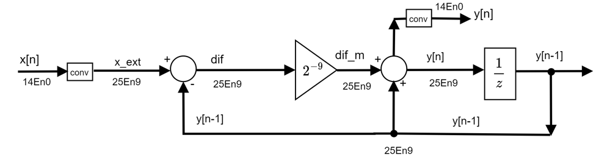
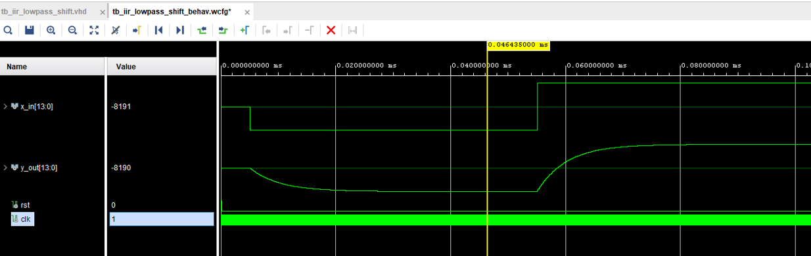
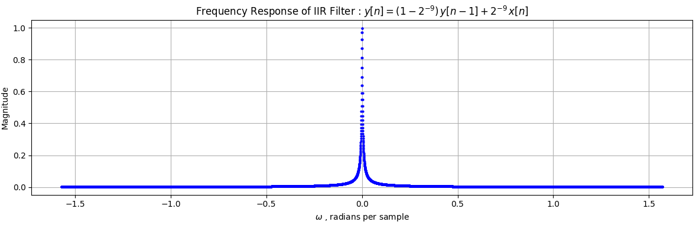
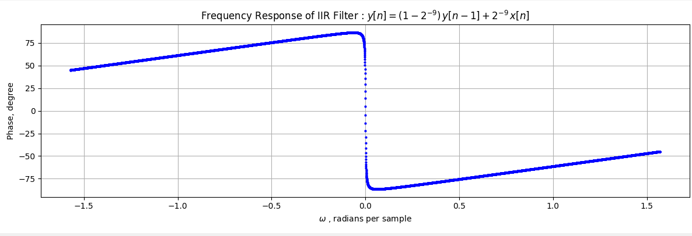

**This design contains VHDL and Verilog implementation of general Low Pass IIR EWMA filter.**

---
**EWMA** stands for **Exponentially Weighted Moving Average**. 
It's a filter/estimator that produces a running average where recent samples count more than older ones, with the weight decaying exponentially the further back in time you go:

$$y[n] = \alpha\, x[n] + (1-\alpha)\, y[n-1]$$

**<mark>Key properties:**</mark>
- **Unity DC gain** when $\alpha + (1-\alpha) = 1$ (always true by construction).
- **Always stable** by construction, its poles are always within unit circle.

- **Time constant** $\ \tau \approx \dfrac{1}{\alpha}$ samples (or more precisely $\tau = \dfrac{-1}{\ln(1-\alpha)}$) , for example if $\alpha = 2^{-9}=0.001953 \Rightarrow \tau\approx512$ samples.
- **Single pole, first-order IIR** — it's literally the discrete-time equivalent of continuous time RC low-pass filter.
- **Very cheap to implement** — only use shift and add, no multiply needed. Unlike a plain moving average, does not need to remember $N$ past samples.

---

**EWMA IIR filter implementation**

$y[n] = \alpha\, x[n] + (1-\alpha)\, y[n-1]$

$y[n] = \alpha\, x[n] + y[n-1] - \alpha\cdot y[n-1]$

$y[n] = y[n-1] + \alpha\cdot( x[n]- y[n-1])$

Implementation example for $\alpha=2^{-9} $( no multiplication needed !):   



Simulation result: 



---
**Why "exponential":** 

If we unroll the recursion, $y[n]$ turns out to be a weighted sum of all past samples, with weights that fall off geometrically:

Starting from:

$$y[n] = \alpha\, x[n] + (1-\alpha)\, y[n-1]$$

Substitute the expression for $y[n-1]$ :

$$y[n-1] = \alpha\, x[n-1] + (1-\alpha)\, y[n-2]$$

So:

$$y[n] = \alpha\, x[n] + (1-\alpha)\left[\alpha\, x[n-1] + (1-\alpha)\, y[n-2]\right]$$

$$y[n] = \alpha\, x[n] + \alpha(1-\alpha)\, x[n-1] + (1-\alpha)^2\, y[n-2]$$

Repeating this substitution one more level (expanding $y[n-2]$):

$$y[n] = \alpha\, x[n] + \alpha(1-\alpha)\, x[n-1] + \alpha(1-\alpha)^2\, x[n-2] + (1-\alpha)^3\, y[n-3]$$

So:
$$\boxed{y[n] = \alpha \sum_{k=0}^{j} \left[(1-\alpha)^k\, x[n-k]\right] + (1-\alpha)^{j+1}\, y[n-j-1]}$$

As $j \to \infty$, the tail term vanishes:

$$\lim_{j\to\infty} (1-\alpha)^{j+1}\,y[n-j-1] = 0$$

This holds because $|1-\alpha| < 1$ (true for any $0 < \alpha < 1$, so the geometric factor decays to zero — provided $y[n-j-1]$ stays **bounded** as $j\to\infty$ (true for any physically reasonable/bounded input signal).

So: 

$$\boxed{y[n] = \alpha \sum_{k=0}^{\infty}\left[(1-\alpha)^k\, x[n-k]\right]}$$

Note, that if x[n] = 1 for all n: 

$${y[n] = \alpha \sum_{k=0}^{\infty}(1-\alpha)^k=\alpha\frac{1}{1-(1-\alpha)}=1 } $$

---

**Calculation of transfer function and poles translation (from digital domain to continuous domain)**


$y[n] = (1-\alpha)\,y[n-1] + \alpha\cdot\,x[n]$

$Y(z) = (1-\alpha)\,z^{-1}Y(z) + \alpha\,X(z)$

$Y(z) = z^{-1}Y(z) -\alpha\,z^{-1}Y(z) + \alpha\,X(z)$


$Y(z)\left(1 - (1-\alpha)\,z^{-1}\right) = \alpha\,X(z)$

The transfer function $H(z)$ :

$$H(z) = \frac{Y(z)}{X(z)} = \frac{\alpha}{1 - (1-\alpha)\,z^{-1}}$$
or
$$H(z) = \frac{Y(z)}{X(z)} = \frac{\alpha{z}}{z - (1-\alpha)}$$


To find the DC gain, we evaluate the transfer function at $z = 1$ (which corresponds to $f = 0\text{ Hz}$ that is DC):


$$\text{DC Gain} = H(z=1) = \frac{\alpha}{1 - (1-\alpha)} = 1$$

Digital filter has a pole at:

$$z_0 = 1-\alpha$$

Exact relation between ${s-}$ plane pole and ${z-}$ plane pole (impulse-invariance relationship) : 
$$\boxed{z_0 = e^{s_0 T}}$$

So: 

$$1-\alpha = e^{s_0 T}$$

Take the natural log of both sides:

$$s_0 T = \ln(1-\alpha)$$

$$s_0 = \frac{1}{T}\ln(1-\alpha)$$

Since $0 < \alpha < 1$, we have $\ln(1-\alpha) < 0$, so $s_0$ is **negative and real** — confirming this maps to a stable, non-oscillating analog pole (a simple real-axis pole, no imaginary part, matching a first-order RC-type response with no resonance).

Rewriting in the standard form $s_0 = -\sigma_0$ (where $\sigma_0$ is continuous equivalent pole):

$$\sigma_0 = -\frac{1}{T}\ln(1-\alpha) = \frac{1}{T}\ln\!\left(\frac{1}{1-\alpha}\right)=\frac{1}{T}\left[ln(1) -ln(1-a) \right]$$

Small-$\alpha$ approximation: for $\alpha \ll 1$ (for example, $\alpha = 2^{-11} \approx 4.88\times10^{-4}$), we can use the Taylor expansion $\ln(1-\alpha) \approx  -\alpha$:

$$\sigma_0 = 2\pi f\approx \frac{\alpha}{T} = \alpha f_s \ [rad/sec]$$

$$f=\frac{\alpha f_s}{2\pi} \ [Hz]$$


for $\alpha=2^{-9}=0.00195$ : $$f=\frac{\alpha f_s}{2\pi}=\frac{2^{-9}\cdot50\cdot10^{6}}{2\cdot\pi}=15542.5\ Hz$$

for $\alpha=2^{-11}=0.0004882$ : $$f=\frac{\alpha f_s}{2\pi}=\frac{2^{-11}\cdot50\cdot10^{6}}{2\cdot\pi}=3885.6\ Hz$$

for $\alpha=2^{-13}=0.00012$ : $$f=\frac{\alpha f_s}{2\pi}=\frac{2^{-13}\cdot50\cdot10^{6}}{2\cdot\pi}=971.4\ Hz$$

for $\alpha=2^{-15}=0.00003051$ : $$f=\frac{\alpha f_s}{2\pi}=\frac{2^{-15}\cdot50\cdot10^{6}}{2\cdot\pi}=242.8\ Hz$$

---

**Frequency Response**

The discrete time frequency response is obtained by evaluating $H(z)$ on the unit circle, (by substituting $z = e^{j\omega}$ , while  $-\pi \leq\omega\leq\pi$):

$$H(e^{j\omega}) = \frac{\alpha}{1-(1-\alpha)\,e^{-j\omega}}$$

Deriving magnitude and phase:

Expand the denominator using Euler's identity, $e^{-j\omega} = \cos\omega - j\sin\omega$:

$$H(e^{j\omega}) = \frac{\alpha}{1-(1-\alpha)\cos\omega + j(1-\alpha)\sin\omega}$$

**Magnitude response:**

$$|H(e^{j\omega})| = \frac{|num|}{|den|}=\frac{\alpha}{\sqrt{\left[1-(1-\alpha)\cos\omega\right]^2 + \left[(1-\alpha)\sin\omega\right]^2}}$$

Expanding the denominator : 

$$\left[1-(1-\alpha)\cos\omega\right]^2 + (1-\alpha)^2\sin^2\omega$$

$$= 1 - 2(1-\alpha)\cos\omega + (1-\alpha)^2\cos^2\omega + (1-\alpha)^2\sin^2\omega$$

$$= 1 - 2(1-\alpha)\cos\omega + (1-\alpha)^2$$

So:

$$\boxed{|H(e^{j\omega})| = \frac{\alpha}{\sqrt{1 + (1-\alpha)^2 - 2(1-\alpha)\cos\omega}}}$$

Magnitude of filter frequency responce for $\alpha = 2^{-9}$ :

```python

# Author: Amit 
# This code presents example of magnitude
# response of filter y[n]=2^-9*x[n]+(1-2^-9)*y[n-1] 
# for alfa = 2^-9

import numpy as np
import matplotlib.pyplot as plt
alpha = 2**-9
w = np.linspace(-np.pi/2,np.pi/2,10000)
H_amp = np.zeros(len(w))
for i , wi in enumerate(w):
    H_amp[i] = alpha/np.sqrt(1+(1-alpha)**2-2*(1-alpha)*np.cos(wi))
# Plotting the frequency response
plt.figure(figsize=(12, 4))
plt.plot(w, H_amp, 'bo', markersize=2)
plt.title('Frequency Response of IIR Filter : $y[n] = (1-2^{-9})\\,y[n-1] + 2^{-9}\\,x[n]$')
plt.xlabel('$\omega$ , radians per sample')
plt.ylabel('Magnitude')
plt.grid(True)
plt.tight_layout()
plt.show()

```




**Phase response:**

$$\angle H(e^{j\omega}) = -\arctan\left(\frac{(1-a)\sin\omega}{1-(1-a)\cos\omega}\right)$$

(negative sign because the phase of $H$ is $0$ (numerator, real constant $a$) minus the phase of the denominator)

Example of phase of frequency response calculation:

```python

# Author: Amit 
# This code presents example of phase
# response of filter y[n]=2^-9*x[n]+(1-2^-9)*y[n-1] 
# for alfa = 2^-9

import numpy as np
import matplotlib.pyplot as plt
alpha = 2**-9
w = np.linspace(-np.pi/2,np.pi/2,10000)
Phase = np.zeros(len(w))
for i , wi in enumerate(w):
    Phase[i] = (-np.arctan( (1-alpha)*np.sin(wi)/(1-(1-alpha)*np.cos(wi)) ))*180/np.pi
# Plotting the frequency response
plt.figure(figsize=(12, 4))
plt.plot(w, Phase, 'bo', markersize=2)
plt.title('Frequency Response of IIR Filter : $y[n] = (1-2^{-9})\\,y[n-1] + 2^{-9}\\,x[n]$')
plt.xlabel('$\omega$ , radians per sample')
plt.ylabel('Phase, degree')
plt.grid(True)
plt.tight_layout()
plt.show()

```
Phase of filter frequency responce for $\alpha = 2^{-9}$ :

 

---


